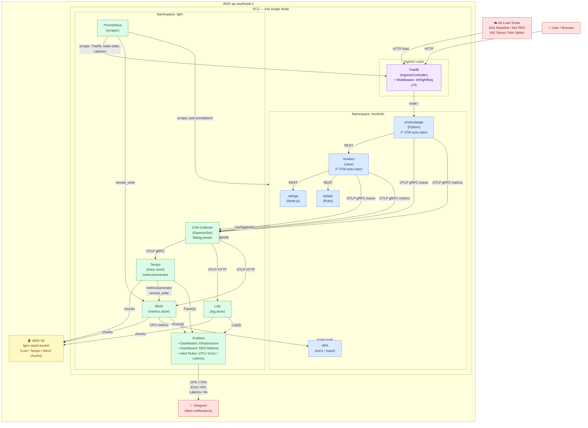

# Kiến trúc hệ thống K8s Observability LGTM



## Luồng dữ liệu theo Signal

| Signal | Thu thập | Xử lý | Lưu trữ | Visualize |
|--------|----------|-------|---------|-----------|
| **Traces** | OTel auto-inject (productpage, reviews) | OTel Collector | Tempo → S3 | Grafana (TraceQL) |
| **Logs** | OTel filelog DaemonSet (toàn cluster) | OTel Collector | Loki → S3 | Grafana (LogQL) |
| **Metrics (app)** | OTel OTLP receiver | OTel Collector | Mimir → S3 | Grafana (PromQL) |
| **Metrics (infra)** | Prometheus scrape (Traefik, cadvisor, kube-state) | Prometheus | Mimir → S3 | Grafana (PromQL) |
| **Service Graph** | Tempo metricsGenerator | remote_write | Mimir → S3 | Grafana (Node Graph) |

## Correlation (Loki ↔ Tempo ↔ Mimir)

```
Grafana: thấy latency spike trên Mimir
    → RED dashboard → Slow Traces panel (Tempo) → click trace
    → Tempo trace waterfall → "Logs for this span" (Loki derived field)
    → Loki logs filtered by traceID
```
